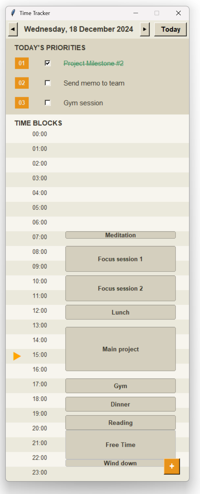

# Time Management App ⏰

A desktop application built with Python and Tkinter for managing daily tasks and time block scheduling.



## Features ✨
- Minimal design to allow you to focus on key daily tasks you want to complete
- Flexible time block scheduling to outline your day
- Interactive UI with drag-and-drop support to easily change your schedule on the fly
- Calendar navigation to plan different days and review your progress
- Keyboard shortcuts for even faster use (see below)

## Installation 🚀

### Prerequisites
- Python 3.8 or higher installed on your system. To check, open Command Prompt (Windows) or Terminal (Mac/Linux) and type: `python --version`
- Git installed on your system (optional - you can also download the repository directly)

### Step-by-step Instructions

1. Get the repository:
   - **Option A**: Clone using Git:
     1. Open Command Prompt (Windows) or Terminal (Mac/Linux)
     2. Navigate to where you want to download the project
     3. Type: `git clone https://github.com/omegarhovega/Time-Tracker.git`
   
   - **Option B**: Download directly:
     1. Go to `https://github.com/omegarhovega/Time-Tracker`
     2. Click the "Code" button
     3. Select "Download ZIP"
     4. Extract the ZIP file to your desired location

2. Navigate to the project folder:
   - Open Command Prompt (Windows) or Terminal (Mac/Linux)
   - Navigate to the project forlder, for example: `cd C:\Users\YourName\Downloads\Time-Tracker`

3. Create a virtual environment:
   - Type: `python -m venv venv`
   - This creates a new folder called 'venv' that will contain a separate Python installation

4. Activate the virtual environment:
   - **On Windows**:
     - Type: `venv\Scripts\activate`
     - If successful, you'll see `(venv)` at the start of your command prompt
   
   - **On Mac/Linux**:
     - Type: `source venv/bin/activate`
     - If successful, you'll see `(venv)` at the start of your terminal prompt

5. Install required packages:
   - Type: `pip install -r requirements.txt`
   - This will install all necessary dependencies for the project

## Usage 📖
Run the application using:
```python
python run.py
```

To deactivate the virtual environment when you're done:
  - Simply type: `deactivate`
  - The `(venv)` prefix should disappear

To delete the venv if no longer needed, type `rmdir /s /q venv` on Windows or `rm -rf venv` on Mac/Linux (deactivate the venv before deletion as per above). Alternatively, you can delete the venv folder in the project folder manually.

## Shortcuts 🎮
- `Ctrl + 1-3`: set top task 1-3
- `Ctrl + N`: create new time block
- `←` or `→`: navigate to previous or next day 

## Contributing 🤝

1. Fork the repository
2. Create a new branch for your feature
3. Commit your changes
4. Push to the branch
5. Create a Pull Request

## License 📄

This project is licensed under the GNU General Public License v3.0 (GPL-3.0).

The full license text can be found in the [LICENSE](LICENSE) file in the repository.

For more details about the GPL-3.0 license, visit:
https://www.gnu.org/licenses/gpl-3.0.en.html

## Support 💬

For support, please create an issue in the GitHub repository.
